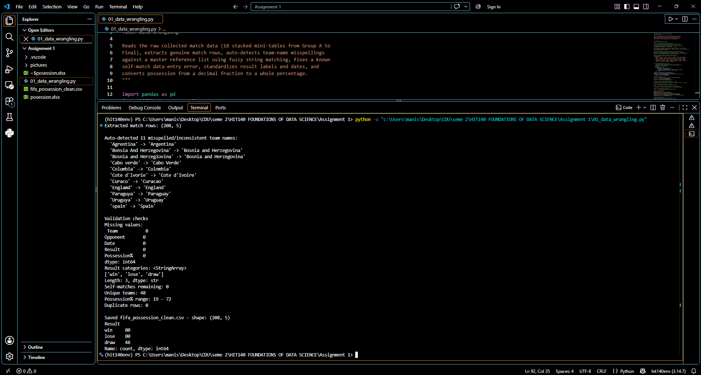
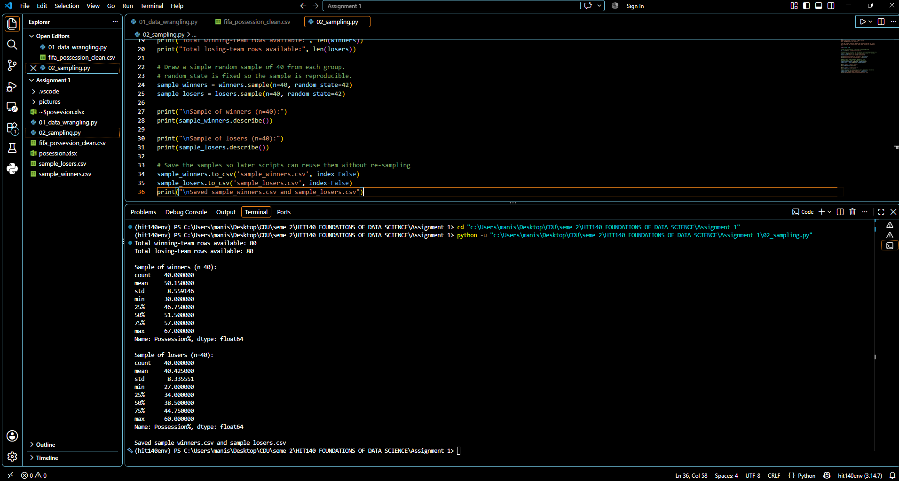
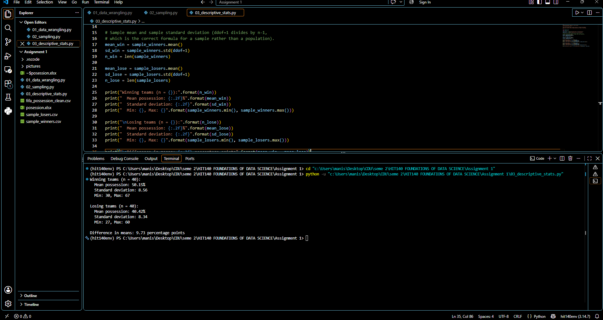
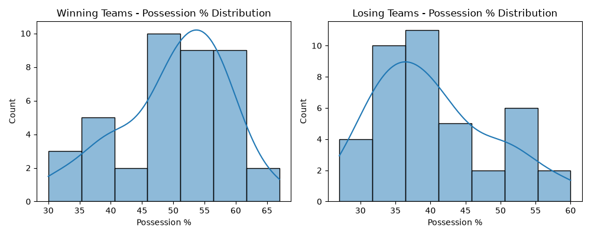
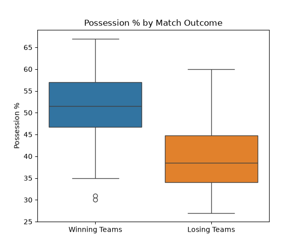
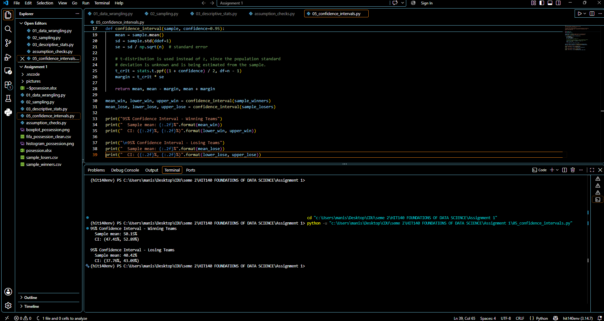
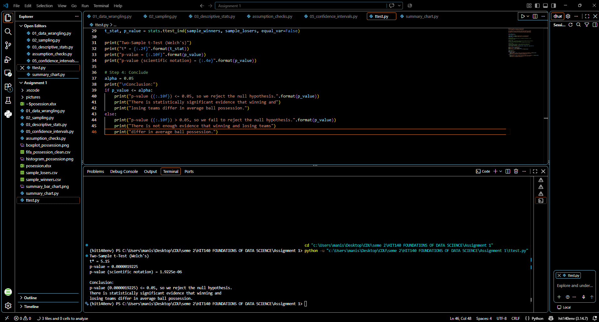

# FIFA World Cup 2026: Ball Possession and Match Outcome
HIT140 / HIT37 — Foundations of Data Science
Assessment 2
Prepared by: Manish (Student ID: S401396)

**An Analysis of the Difference in Average Possession Percentage Between Winning and Losing Teams**


## 1. Introduction and Analytic Question

Ball possession is one of the most widely discussed statistics in football, often assumed to reflect a team's control over a match. This report investigates whether that assumption holds statistically at the FIFA World Cup 2026 by examining the relationship between ball possession and match outcome.

**Analytic question:** Is there a statistically significant difference in average ball possession percentage between winning teams and losing teams at the FIFA World Cup 2026?

This question was investigated using a two-sample (independent) t-test, comparing the mean possession percentage of a random sample of winning teams against a random sample of losing teams. This report follows the full analytic pipeline required by the assignment: data wrangling, data preparation and sampling, descriptive statistics, confidence interval estimation, and hypothesis testing.

---

## 2. Data Wrangling

The raw dataset (`posession.xlsx`) was collected from FIFA World Cup 2026 statistics sources and stored as 18 separate stacked mini-tables within a single spreadsheet (one table per group and knockout round), each with its own repeated header row and blank separator rows. Before any analysis could be performed, this raw structure needed to be transformed into a single, clean, analysis-ready table.

### 2.1 Extraction of Genuine Match Rows

A filtering rule was applied so that only rows containing a valid `Result` value (`win`, `lose`, or `draw`) were kept. Since every genuine match row contains one of these three values while header rows, group labels, and blank separator rows do not, this reliably isolated the 208 genuine match records from the raw file.

### 2.2 Whitespace Normalisation

Internal whitespace in team names was collapsed (e.g. `South  Africa` with a double space was corrected to `South Africa`) before any further processing, to prevent whitespace inconsistencies from being miscounted as distinct teams.

### 2.3 Fuzzy Matching Against a Master Team List

A master reference list of the 48 correct team names competing in the tournament was constructed. Each team name appearing in the raw data was compared against this master list using Python's `difflib.get_close_matches` function, which measures string similarity and suggests the closest valid match. This automatically identified and corrected 11 misspelled or inconsistent team names, such as `Agrentina` → `Argentina` and `Paraguya` → `Paraguay`, without requiring manual inspection of all 208 rows.


*Figure 1. Data wrangling script output, showing row extraction, auto-detected misspellings, validation checks, and the final saved dataset.*

### 2.4 Manual Correction of a Data-Entry Error

One row recorded a match as `Congo DR vs Congo DR`, which is not a valid fixture. Fuzzy matching cannot detect this type of logical error, since both values are individually valid team names. This was identified through manual inspection and corrected based on the corresponding fixture record.

### 2.5 Standardisation

- Result values were standardised to lowercase (`win`, `lose`, `draw`).
- Possession values were converted from decimal fractions (e.g. `0.57`) to whole percentages (e.g. `57`).
- Dates were standardised to `YYYY-MM-DD` format.

### 2.6 Validation

Five validation checks were performed after cleaning: a check for missing values, a check that `Result` contained only the three expected categories, a check for remaining self-matches, a check that exactly 48 unique team names remained, and a check for duplicate rows. All five checks passed, confirming the dataset was clean and ready for analysis. The final cleaned dataset contained 208 rows: 80 wins, 80 losses, and 48 draws.

---

## 3. Data Preparation and Sampling

The population for this analysis is defined as all matches played at the FIFA World Cup 2026 with recorded possession data. Draws were excluded, since the analytic question specifically concerns the difference between winning and losing outcomes, leaving two available groups: 80 winning-team match records and 80 losing-team match records.

A simple random sample of **n = 40** was drawn independently from each group using Python's pandas `sample()` function with a fixed random seed for reproducibility. A sample size of 40 per group was chosen because it comfortably exceeds the minimum of 30 required by the Central Limit Theorem for the sampling distribution of the mean to be approximately normal, regardless of the shape of the underlying population distribution.


*Figure 2. Random sampling output, showing population sizes and descriptive summaries of the two n = 40 samples.*

---

## 4. Descriptive Statistics

| Group | n | Mean (%) | Std. Dev. | Min | Max |
|---|---|---|---|---|---|
| Winning teams | 40 | 50.15 | 8.56 | 30 | 67 |
| Losing teams | 40 | 40.42 | 8.34 | 27 | 60 |

On average, winning teams held 50.15% possession compared to 40.42% for losing teams, a difference of 9.73 percentage points in the sample. The two groups show similar variability (standard deviations of 8.56 and 8.34 respectively), suggesting the assumption of unequal variances need not be strongly emphasised, though it was still accounted for in the inferential test below.


*Figure 3. Descriptive statistics output for winning and losing teams.*

---

## 5. Checking Statistical Assumptions

Before proceeding to inference, the sample data were visually inspected to check whether the assumptions underlying the t-test were reasonably satisfied.

### 5.1 Normality

Histograms of both samples were plotted to inspect their distributional shape.


*Figure 4. Histograms of possession percentage for winning teams (left) and losing teams (right), with a kernel density curve overlaid.*

Both distributions appear reasonably bell-shaped and unimodal, without severe skew. Since the sample size in each group (n = 40) also exceeds the threshold of 30 required by the Central Limit Theorem, the sampling distribution of the mean can be treated as approximately normal even if the underlying population distribution is not perfectly normal.

### 5.2 Outliers

A boxplot was used to compare the two groups directly and check for outliers.


*Figure 5. Boxplot comparing possession percentage between winning and losing teams.*

The two boxes are clearly separated with almost no overlap in their interquartile ranges, visually suggesting a real difference in typical possession values between the two groups. One mild outlier was observed in the winning-teams group (a match with 30% possession). This value was retained in the analysis, as there was no indication it resulted from a data-entry error rather than a genuine match result.

### 5.3 Equality of Variances

Because the two sample standard deviations were similar but not identical (8.56 vs 8.34), Welch's t-test was used rather than the standard (pooled-variance) two-sample t-test. Welch's t-test does not assume equal population variances between groups, making it the more robust and appropriate choice here.

---

## 6. Confidence Interval Estimation

A 95% confidence interval was calculated for the true population mean possession percentage of each group, using the t-distribution (since the population standard deviation is unknown and estimated from the sample):

```
CI = x̄ ± t* × (s / √n)
```

| Group | Sample Mean | 95% Confidence Interval |
|---|---|---|
| Winning teams | 50.15% | (47.41%, 52.89%) |
| Losing teams | 40.42% | (37.76%, 43.09%) |


*Figure 6. 95% confidence interval output for winning and losing teams.*

There is a 95% chance that the true mean possession percentage of all winning teams at the FIFA World Cup 2026 lies between 47.41% and 52.89%. Similarly, there is a 95% chance that the true mean possession percentage of all losing teams lies between 37.76% and 43.09%. Notably, these two intervals do not overlap at all, which is a strong preliminary indication that the two population means genuinely differ — a result formally confirmed by the hypothesis test below.

---

## 7. Two-Sample t-Test (Inferential Statistics)

### Step 1: State
Do winning and losing teams differ in average ball possession percentage at the FIFA World Cup 2026?

### Step 2: Plan

```
H0: μ1 = μ2      Ha: μ1 ≠ μ2
```

A two-tailed test was used, as there was no prior directional assumption about which group would have higher possession. Welch's two-sample t-test was selected over the standard pooled-variance t-test because it does not require the assumption of equal population variances between groups, which is a more conservative and appropriate choice given the sample standard deviations were not identical.

### Step 3: Solve

Both samples (n = 40 each) were confirmed to be simple random samples, and the assumption of approximate normality was checked in Section 5. The t-statistic was calculated as:

```
t* = (x̄1 − x̄2) / √(s1²/n1 + s2²/n2)
```

*Figure 7. Two-sample Welch's t-test output, showing the t-statistic and p-value.*

The test produced **t\* = 5.15**, with an associated two-tailed **p-value of 0.0000019** (1.92 × 10⁻⁶).

### Step 4: Conclude

Since the p-value (0.0000019) is far below the significance threshold of 0.05, the null hypothesis is rejected. There is strong statistical evidence that winning teams and losing teams differ in their average ball possession percentage at the FIFA World Cup 2026, with winning teams showing significantly higher average possession (50.15%) than losing teams (40.42%).

---

## 8. Discussion and Limitations

The results indicate a clear and statistically significant association between ball possession and match outcome at the FIFA World Cup 2026: on average, winning teams held approximately 9.7 percentage points more possession than losing teams in the samples analysed. This finding is consistent with the general football-analytics intuition that greater control of the ball is associated with match success, although possession alone does not determine the outcome of every individual match, as reflected by the spread observed within each group and the presence of an outlier.

Several limitations should be acknowledged:

1. **No control for confounding factors** — team quality, match context (e.g. group stage vs knockout), and scoreline effects (teams already leading sometimes cede possession deliberately) were not accounted for.
2. **Sample size** — while n = 40 satisfies the Central Limit Theorem, a larger sample drawn from the full population of matches could yield a more precise confidence interval.
3. **Draws excluded** — conclusions apply specifically to decisive (win/lose) matches rather than all matches played.

---

## 9. Conclusion

This analysis set out to determine whether winning and losing teams at the FIFA World Cup 2026 differ in average ball possession percentage. Using a random sample of 40 matches per group, descriptive statistics, 95% confidence intervals, and a Welch's two-sample t-test, strong evidence was found that they do: winning teams averaged 50.15% possession compared to 40.42% for losing teams, a difference that is highly statistically significant (t\* = 5.15, p = 0.0000019). This supports the conclusion that ball possession is meaningfully associated with match success at this tournament.

---

## Files in This Folder

| File | Purpose |
|---|---|
| `01_data_wrangling.py` | Cleans and validates the raw match data |
| `02_sampling.py` | Draws the n = 40 random sample for each group |
| `03_descriptive_stats.py` | Computes descriptive statistics |
| `04_histogram_boxplot.py` | Checks normality and outliers |
| `05_confidence_intervals.py` | Computes 95% confidence intervals |
| `06_two_sample_t_test.py` | Runs the Welch's two-sample t-test |
| `posession.xlsx` | Raw source data |
| `fifa_possession_clean.csv` | Cleaned dataset (output of step 1) |
| `sample_winners.csv` / `sample_losers.csv` | Sampled data (output of step 2) |
| `Result_screenshots/` | Terminal output and chart screenshots for each stage |

## How to Run

1. Install dependencies:
   ```
   pip install pandas numpy scipy matplotlib seaborn openpyxl
   ```
2. Run the scripts in numbered order (01 → 06). Each stage reads the CSV output produced by the previous stage, so they must be run in sequence.

## Environment

- Python 3.14.7
- Conda environment: `hit140env`
- Key libraries: pandas, numpy, scipy, matplotlib, seaborn, openpyxl