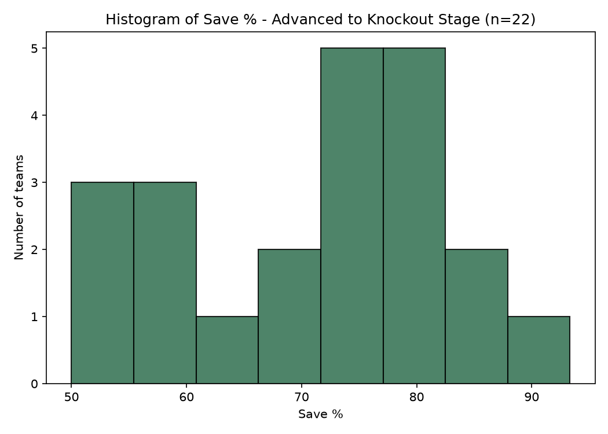
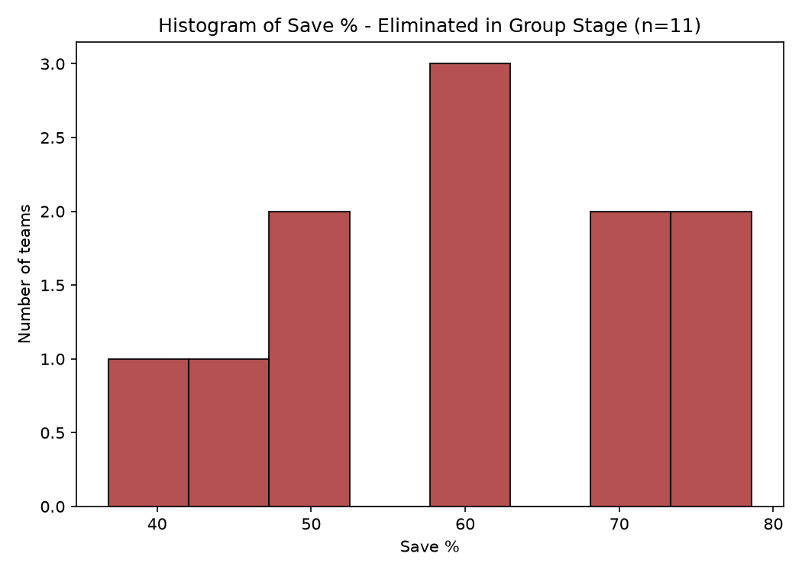
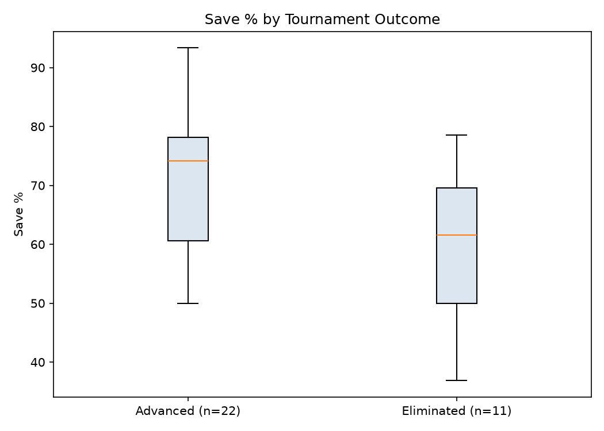

# FIFA World Cup 2026 – Goalkeeping & Defensive Performance Analysis

## 1. Analytic Question

**On average, is there a statistically significant difference in save percentage between goalkeepers whose team advanced to the knockout stage and goalkeepers whose team was eliminated in the group stage at the FIFA World Cup 2026?**

Save percentage was used to make the comparison fair because teams played very different numbers of matches (eliminated teams always played exactly 3 group-stage games, while advanced teams played 4–8). Save % is a rate (saves ÷ shots faced), not a raw total, so it does not mechanically grow with more games the way a count like total saves or total goals conceded would.

**Formula:**

`Save % = Goalkeeper Saves / (Goalkeeper Saves + Goals Conceded) × 100`

---

## 2. Data Wrangling

Team-level goalkeeping statistics (clean sheets, goals conceded, goalkeeper saves, and goalkeeping actions inside/outside the penalty area) for all 48 FIFA World Cup 2026 teams were sourced from FIFA.com's official team statistics pages, live-browsed alongside the tournament's standings and fixtures. Each team was labelled **advanced** (reached the Round of 32 or beyond) or **eliminated** (exited after the group stage) by checking membership against the official Round of 32 qualifier list, cross-checked against Al Jazeera's and Wikipedia's reporting of the knockout draw.

Save percentage is not published directly by these sources, so it was engineered during wrangling as `goalkeeper_saves / (goalkeeper_saves + goals_conceded) × 100` — the standard approximation for saves ÷ shots-on-target-against used by mainstream football statistics providers (e.g. FBref), since shots on target against = saves + goals conceded. See `01_data_wrangling.py`.

**Limitation:** FIFA.com reports goalkeeper saves and goals conceded at team level, not cleanly per individual keeper, and several squads used more than one goalkeeper during the tournament (e.g. England: Jordan Pickford + Dean Henderson; Ghana: Ati Zigi + Asare; Senegal: Mendy + Diaw). Each row is therefore really "the team's combined goalkeeping save %," used as a proxy for "the goalkeeper," not a guaranteed single-player figure. This is a genuine data-availability constraint from the source, not a wrangling error.

**Source access note:** thestatsdontlie.com requires a league to be manually selected from a dropdown before any World Cup 2026 table loads (not scrapeable), and FBref returned HTTP 403 (bot-blocked) on every 2026-season URL attempted. FIFA.com's own stats pages were used as the accessible source instead. Full source list in `sources.md`.

---

## 3. Data Preparation and Sampling

The 48 teams are the full 2026 tournament population (32 advanced, 16 eliminated), not a sample. A **stratified random sample of 33 teams** was drawn from this population, preserving the population's 2:1 advanced-to-eliminated ratio. `random_state=42` was used to make the random selection reproducible.

| Group | Population | Random Sample |
|---|---:|---:|
| Advanced to knockout stage | 32 | 22 |
| Eliminated in group stage | 16 | 11 |
| **Total** | **48** | **33** |

**Games-played fairness note:** unlike a goals-conceded comparison, this analysis does not need a group-stage-only restriction — eliminated teams only ever had 3 games to draw from, and advanced teams' extra knockout games just add more shots to the same save/goals-conceded ratio (more precision, not a count-inflation bias the way raw totals would be). Full-tournament save % figures are the appropriate ones to use here, and this is visible in the data: the eliminated group has the *higher* standard deviation (13.36 vs 12.49) despite having fewer games, consistent with a smaller, less precise sample rather than any bias in the metric itself.

---

## 4. Descriptive Statistics

| Statistic | Advanced (n=22) | Eliminated (n=11) |
|---|---:|---:|
| Sample Size (n) | 22 | 11 |
| Mean | 71.19 | 60.21 |
| Median | 74.17 | 61.54 |
| Mode | 50.00 | 50.00 |
| Sample Variance | 155.88 | 178.42 |
| Standard Deviation | 12.49 | 13.36 |
| Minimum | 50.00 | 36.84 |
| Maximum | 93.33 | 78.57 |
| Q1 | 60.62 | 50.00 |
| Q3 | 78.14 | 69.62 |
| IQR | 17.52 | 19.62 |

The difference between the sample means was:

`71.19 − 60.21 = 10.98`

Goalkeepers on teams that advanced to the knockout stage saved, on average, **10.98 percentage points more shots** than goalkeepers on teams eliminated in the group stage. The median shows the same pattern (74.17 vs 61.54), and both groups share the same modal value (50.00), reflecting how several eliminated and lower-tier advanced teams clustered around a 50% save rate.

---

## 5. Histograms and Boxplot

### Advanced to Knockout Stage

The distribution is left-skewed: most advanced teams cluster in the 60–90% save range, with a small tail of lower-performing goalkeepers around 50%. This is consistent with the median (74.17) sitting above the mean (71.19).

### Eliminated in Group Stage

Eliminated teams' save percentages are more spread out and centred lower, with more mass in the 36–60% range — consistent with weaker goalkeeping (and defending in front of the goalkeeper) contributing to an early exit.

### Boxplot Comparison

The boxplot makes the separation between groups visually clear: the advanced group's interquartile range sits almost entirely above the eliminated group's median, though the two distributions still overlap at the tails.

---

## 6. Inferential Statistics – 95% Confidence Interval

| Group | Mean | Lower Limit | Upper Limit | Interval Size |
|---|---:|---:|---:|---:|
| Sample overall (n=33) | 67.53 | 62.70 | 72.36 | 9.66 |
| Advanced (n=22) | 71.19 | 65.66 | 76.73 | 11.07 |
| Eliminated (n=11) | 60.21 | 51.24 | 69.19 | 17.95 |

At the **95% confidence level**, the estimated population mean save % across the sampled 2026 World Cup teams ranges from **62.70% to 72.36%**. The eliminated group's interval is noticeably wider (17.95 vs 11.07) reflecting its smaller sample size (n=11) — a limitation to keep in mind when interpreting the group-level estimates individually.

---

## 7. Inferential Statistics – Two-Sample t-Test

### Step 1: State

**Analytic Question:** On average, is there a statistically significant difference in save percentage between goalkeepers whose team advanced to the knockout stage and goalkeepers whose team was eliminated in the group stage at the FIFA World Cup 2026?

### Step 2: Plan

A **two-sided, independent two-sample t-test** was used since the question asks whether a difference exists, without specifying its direction.

**Hypotheses:**

**H₀: μ_advanced = μ_eliminated** — there is no difference in the population mean save % between advanced and eliminated teams' goalkeepers.

**Hₐ: μ_advanced ≠ μ_eliminated** — there is a difference in the population mean save % between the two groups.

**Welch's t-test** (unequal-variance) was used rather than a pooled-variance (Student's) t-test because the two groups have both unequal sample sizes (22 vs 11) and unequal variances (SD 12.49 vs 13.36) — eliminated teams only ever played 3 group-stage games, so their save % estimate carries more sampling variability than advanced teams' figures.

### Step 3: Solve

| Statistic | Advanced | Eliminated |
|---|---:|---:|
| Sample Size | 22 | 11 |
| Mean | 71.19 | 60.21 |
| Standard Deviation | 12.49 | 13.36 |

| Test Result | Value |
|---|---:|
| t-statistic (t*) | 2.274 |
| p-value | 0.035 |
| Significance Level (α) | 0.05 |
| Decision | **Reject H₀** |

Since **0.035 < 0.05**, the null hypothesis is rejected.

### Step 4: Conclude

Since the **p-value (0.035) is less than 0.05**, the null hypothesis is rejected. There is **statistically significant evidence that goalkeepers on teams that advanced to the knockout stage differ from goalkeepers on teams eliminated in the group stage** in their average save percentage.

Advanced-stage teams recorded a higher sample mean (**71.19%**) than eliminated teams (**60.21%**), supporting the conclusion that stronger goalkeeping was associated with tournament success at the 2026 World Cup.

---

## 8. Limitations

1. **Multi-goalkeeper squads.** England, Ghana and Senegal (among others) used two different goalkeepers during the tournament. Save % here reflects the *team's* combined goalkeeping output, not always one individual's performance.
2. **Single-source data.** thestatsdontlie.com and FBref could not be scraped (dropdown-gated and bot-blocked respectively), so all figures come from FIFA.com alone. This is a defensible but narrower source base than ideally used, and is flagged for the tutor.
3. **Uneven group precision.** The eliminated group (n=11) has a wider confidence interval than the advanced group (n=22) simply from having fewer teams and fewer games to draw shots from — addressed by using Welch's (not pooled-variance) t-test.

---

## 9. Files in This Folder

| File | Description |
|---|---|
| `raw_team_goalkeeping_stats.csv` | Raw per-team goalkeeping metrics as sourced from FIFA.com (before save % is engineered) |
| `round_of_32_qualifiers.csv` | The 32 teams that reached the knockout stage, used to label each team advanced/eliminated |
| `fifa_team_savepct_advanced_vs_eliminated.csv` | Wrangled population dataset — all 48 teams, with save % engineered (output of Step 1) |
| `fifa_SAMPLE_savepct_n33.csv` | Stratified random sample (n=33) used for all descriptive/inferential analysis (output of Step 2) |
| `01_data_wrangling.py` – `06_two_sample_t_test.py` | Analysis scripts, run in order |
| `screenshots/` | Terminal output and plots from running each script |

**Student:** Shishir Rai (Zero) · Student ID S397831 · Charles Darwin University
**Unit:** HIT140 – Foundations of Data Science, S2 2026 · Group Assessment 2, Objective 1
